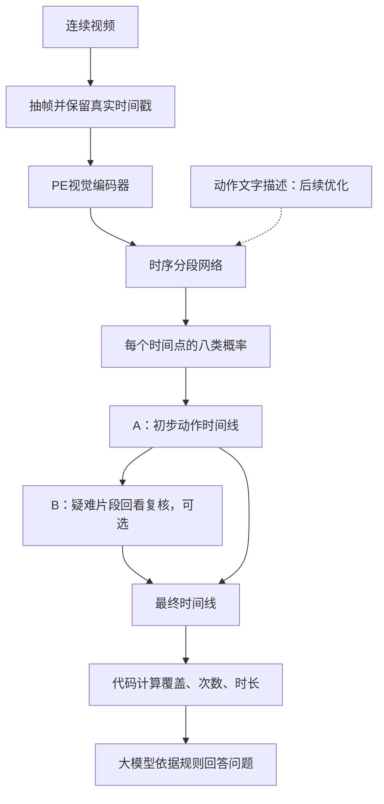

# 六步洗手模型实施方案

> 当前交付路线见[逐步实施主计划](../IMPLEMENTATION_PLAN.zh-CN.md)。本文的 PE、
> MS-TCN++、语言辅助与局部视频复核是可选研究方案；实时摄像头网页是主计划的正式目标，
> 不以本文中的离线视频原型替代。

版本：2026-09-29。适用周期：15—30天。目标：先保证识别效果，再增加语言辅助与问答。

**本文是待实现的方案，不是已完成的功能说明。** 第一版采用“PE视觉编码器＋时序分段网络”，输出动作时间线；随后加入语言辅助、B局部复核和问答。现有README中的YOLO＋GRU方案保留为历史候选，不代表本文的新模型已经接入。参数表是实验起点，不能直接当作现有CLI配置使用。

## 1. 做出来是什么样

输入一段完整洗手视频，输出每个动作的开始时间、结束时间和类别。例如：

| 开始 | 结束 | 动作 |
| --- | --- | --- |
| 0秒 | 3秒 | 其他动作 |
| 3秒 | 8秒 | 掌心相对 |
| 8秒 | 13秒 | 搓手背 |
| 13秒 | 18秒 | 十指交叉 |
| 18秒 | 23秒 | 搓拇指 |
| 23秒 | 28秒 | 搓指尖 |

这些时间只是输出示例，不是实测结果。区间长短由模型识别出的动作变化决定，不按固定5秒切段。允许缺步、乱序和重复，不强迫输出完整的1→6。

系统根据时间线计算六步覆盖、各步累计时长和重复次数。对上例可报告“未检出第4步”；画面存在遮挡时，应提示“无法确认”，不能把看不清直接当成没做。第一版分析已录制的完整视频，可以使用前后文；实时摄像头版另行设计。

## 2. 模型分成三层



| 层 | 负责什么 | 第一版是否需要训练 |
| --- | --- | --- |
| A基础识别 | 看视频、识别动作、确定时间区间 | 训练时序网络；先冻结视觉编码器 |
| B局部复核 | 回看A难以区分的片段，尝试纠错 | 先测现成视频大模型，有收益再考虑微调 |
| 问答层 | 解释漏步、时长、重复，引用对应区间 | 先用提示词和统计函数，不训练 |

先交付A＋问答。B必须在验证集证明“纠正的错误多于引入的错误”后再接入。

## 3. 先把数据准备对

### 3.1 用什么数据和标签

PSKUS作为主训练数据：3,185段医院视频，30 FPS，原始动作标签为0—7。METC作为跨场景测试：212段视频，约16 FPS，公开动作标签为0—6。完整来源见[PSKUS](https://zenodo.org/records/4537209)和[METC](https://zenodo.org/records/5808789)。

| 原始code | 训练类别 | 中文名称 |
| --- | --- | --- |
| 0 | other | 其他动作 |
| 1 | step_1 | 掌心相对 |
| 2 | step_2 | 搓手背 |
| 3 | step_3 | 十指交叉 |
| 4 | step_4 | 指背互扣 |
| 5 | step_5 | 搓拇指 |
| 6 | step_6 | 搓指尖 |
| 7 | faucet_off | 用纸巾关闭水龙头 |

表中的step_1等是阅读简称，代码中使用`core/labels.py`的规范枚举。新建独立的PSKUS八类标签空间，不直接覆盖旧十类空间。原始code、训练通道下标和中文名称的映射必须随checkpoint保存。

`other`既可能发生在洗手期间，也可能出现在其他时刻；它不等于“错误动作”。PSKUS没有独立的开水龙头类别。METC把错误执行合并进other，因此不能拿它直接训练六种具体动作的质量判断。

### 3.2 准备顺序

1. 按原始视频划分train/val/test，起点比例70%/15%/15%，固定seed=42。人物身份可确认时优先按人物分组；至少检查机位、日期和重复视频，记录剩余泄漏风险。
2. 初筛子集覆盖多个分片、机位和六类动作，不能只取单个DataSet。相同划分用于所有对照实验。
3. 从原视频按时间采样，第一轮5 FPS；保留原始帧号和时间戳。30 FPS视频的第90帧约为3秒，不能用90÷5计算时间。
4. PSKUS的`frame_time`以毫秒计，除以1000转成秒；按时间戳对齐抽出的画面与标注。METC使用其原始JSON标签与视频时序，单独适配，不假定30 FPS。
5. 保存每个采样点的`video_id、split、原始帧号、timestamp_s、图像路径、动作标签、标注者`。没有可靠标注的帧保留掩码，不擅自填为other。
6. 人工逐帧抽查至少10段，覆盖六步、切换边界和不同机位；确认“画面—标签—时间”一致后再抽全量。

METC作为最终测试时，不用它选模型、改描述或调阈值。若另做少样本适配，必须单独划出适配集，并与零适配结果分开报告。自采视频也要区分开发集与最终测试集。

## 4. A模型怎么搭

### 4.1 看一帧：PE视觉编码器

优先使用预训练`PE-Core-L14-336`，通过官方接口提取每帧的全局特征。采用checkpoint配套的图像预处理和归一化，不沿用YOLO的预处理。先输入全画面，再比较能完整保留双手的稳定区域裁剪；裁剪失败时回退全画面。

假设每秒5帧，28秒视频约有140帧。视觉编码器把这些画面变成140个特征向量，每个向量表示对应画面的视觉信息，还没有动作类别。

```text
图像批次：        [B, T, 3, 336, 336]
逐帧编码后：      [B, T, D]
线性投影后：      [B, T, 256]
```

`B`是批次中的视频窗口数，`T`是每个窗口的帧数，`D`从编码器实际输出读取。先冻结PE、分小批提取特征并缓存到本地；训练时只读取特征，避免每轮重复处理图像。缓存记录checkpoint、预处理、划分和时间戳，设置变化时重新提取。

### 4.2 看连续变化：时序分段网络

采用[MS-TCN++](https://github.com/sj-li/MS-TCN2)的多阶段时序卷积结构。它沿时间轴处理特征，为每个时间点输出八类概率，后续阶段细化前面的预测。使用公开实现并保留其来源，不把简化TCN声称为完整复现。

```text
时序网络输入：    [B, 256, T]
分类输出：        [B, 8, T]
每个时间点标签：  [B, T]
```

网络内部使用`[B,8,T]`计算损失；接入仓库模型接口时转置为`[B,T,8]`，与训练、评估和推理保持一致。

视频窗口可能跨越动作切换，因此每帧都要有自己的标签，不能用窗口多数标签监督整段。短窗口补齐后使用mask，padding不参与分类损失、平滑损失或指标。不同窗口保持独立，不能按相同video_id误拼成一个时间序列。

### 4.3 第一轮训练参数

| 项目 | 起始设置 | 什么时候改 |
| --- | --- | --- |
| 采样率 | 5 FPS | 细微动作混淆时与10 FPS对照 |
| 视觉编码器 | 冻结PE-Core-L14-336 | 分段头收敛仍不足时，单独试微调后几层 |
| 训练窗口 | 128帧，约25.6秒 | 同时允许跨动作边界，短视频padding |
| batch size | 8个特征窗口 | 根据显存调整，不把它理解为8张图 |
| 通道数 | 特征投影256，时序隐藏通道64 | 先不扩宽网络 |
| 网络阶段 | 1个预测生成阶段＋2个细化阶段 | 其余卷积结构先沿用公开实现默认值 |
| 优化器 | AdamW，学习率1e-3，weight decay=1e-4 | 学习率仅适用于冻结特征上的分段头 |
| 训练轮数 | 最多30轮，验证指标连续5轮未改善则停止 | 按验证集Macro-F1保存最佳权重 |
| 损失 | 掩码加权交叉熵＋原实现的截断平滑损失 | 平滑权重从0.15起，与0对照 |

类别权重只用训练集统计，可从`1/sqrt(类别频率)`开始，归一化到平均为1，并限制极端权重。各阶段都参与监督。窗口从同一视频连续取帧，不随机拼接不同时间点；涉及裁剪、翻转等增强时，同一窗口使用相同的几何变换。

先用一个小训练子集检查模型能否明显拟合，再跑完整训练。验收看验证集逐类召回率、Macro-F1和动作段F1，不能只看被other主导的Accuracy。训练、验证和测试均不得因缺少真实数据而静默回退到合成样本。

### 4.4 把预测合并成时间区间

推理覆盖整段视频，窗口长度128、步长64作为起点。重叠部分先平均分类概率，再取类别；不能先取类别后随意投票。尾部补齐并用mask去掉，保证视频最后一个动作也被预测。

```text
各窗口概率 → 按原始时间位置合并 → 每个时刻取最高概率类别
          → 相邻同类合成区间 → 写入开始时间、结束时间和置信度
```

区间统一用`[start_s, end_s)`表示：从第一帧时间戳开始，到下一段的第一帧时间戳结束；最后一段结束于真实视频末尾。时长按时间差计算。5 FPS提供约0.2秒的采样间隔，不代表实际边界误差必然小于0.2秒。

先保留原始时间线。可另试约0.6秒的概率平滑，但不得无条件删除所有短段，否则真实的“某步太短”也会消失。低置信度用`uncertain`状态表示，不替换成other，不强制恢复标准顺序。

### 4.5 A跑通后，再加语言辅助

为六步和关水龙头各写2—3条经人工核对的短描述。例如“掌心相对摩擦”和“掌心相对，手指交叉摩擦”，突出容易混淆的视觉差异。使用PE配套文本编码器，检查token长度，避免描述被截断。

将文本向量归一化后按类别平均，得到动作文本原型；再将时序隐藏特征投影到相同维度。增加视频特征与正确文本原型之间的对比分类损失，辅助权重先取0.1。保留原八类分类头作为输出；other不参加这项文本对齐损失。没有标签或标注分歧较大的帧不用于强文本对齐。

比较“同一模型不加文本”和“加文本”，其余设置相同。收益不足就保留纯视觉版本。由类别映射得到的句子属于标准动作描述，不能声称模型额外观察到了指尖接触、左右手覆盖等未标注细节。

## 5. B如何作为A的优化

先试`Qwen3-VL-4B-Instruct`对疑难片段做选择题。第一版B仅复核类别，沿用A的区间边界。每次提供对应片段和前后约1秒上下文，同时明确待判断的是中间区间；片段较长或含明显切换时拆开复核。

候选选择A最可能的两个动作，另加“其他类别”和“无法判断”。例如询问“中心区间更符合掌心相对，还是掌心相对且手指交叉？”。B必须看到实际视频，不能只看标签和标准六步顺序。

触发条件可用最高概率偏低、前两类概率接近或短时间频繁跳变。先在验证集调节阈值和调用比例，不能根据测试集答案挑片段。模型自报的置信度不直接当作可靠概率。

融合规则先保持简单：未触发时保留A；B返回“其他类别／无法判断”时保留A的候选并标记待确认；B选择另一动作时，仅在验证过的纠错策略下替换。记录A原结果、B输出和最终决定，以便统计纠正数与改错数。

B的验收同时看最终动作段F1、漏步检测、纠错净收益和额外耗时。也抽查A高置信度样本，防止只研究低置信度而遗漏系统性误判。B没有稳定收益时，不进入最终默认流程。

## 6. 问答读取什么

每个区间保存如下记录。以下是建议的新输出格式，尚未修改现有`core/schema.py`。

```json
{
  "video_id": "demo_01",
  "start_s": 3.0,
  "end_s": 8.0,
  "label": "step_1_palm_to_palm",
  "description": "掌心相对搓洗",
  "mean_probability": 0.86,
  "status": "recognized",
  "reviewed_by_b": false
}
```

代码先计算各步覆盖、累计时长、重复次数和不确定区间。问答模型接收这些记录、明确的评估规则和用户问题，回答时引用区间。例如“3—8秒检出掌心相对搓洗，持续5秒”。`mean_probability`是分类概率的均值，不等同于校准后的正确率。

单步时长阈值、允许重复和顺序要求属于项目评估口径，需明确配置，不能让大模型临时编造，也不能冒称为WHO硬性标准。不确定区间占据关键部分时，回答“无法确认”。现有标签不能证明洗手达到清洁效果，也不足以判断每个动作的精细执行质量。

## 7. 在仓库里按什么顺序实现

以下是方案编写时发现的问题与当前状态。代码已修复前四项的实现缺口；原始数据尚未放在此工作区，因此需要在准备真实数据后人工抽查标签和时间对齐。

| 顺序 | 工作与位置 | 完成标志 |
| --- | --- | --- |
| 1 | 按原始标注时间戳给抽样帧赋标签，并保留原视频帧号 | 代码已实现；真实数据仍需人工逐帧核对 |
| 2 | 修正原始帧时间戳与限帧逻辑 | 代码使用原视频FPS/解码时间戳并均匀限帧；未知帧数时按上限停止 |
| 3 | 恢复模型源码目录不被根级权重忽略规则排除 | `.gitignore`已限制为根目录`/models/`；当前工作区没有`.git`元数据可核对索引 |
| 4 | 补METC公开JSON适配、七类标签空间和external评估 | 代码已实现，使用0=other、1—6=六步；运行需下载原数据 |
| 5 | 新增PE特征提取、时序窗口Dataset和MS-TCN++分段模型 | **尚未实现**；当前训练模型仍是YOLO分类骨干与GRU/TCN帧级头 |
| 6 | 把完整视频预测导出为动作区间并核对边界 | **尚未实现**；当前有逐帧预测与完整性报告 |
| 7 | 增加文本对齐、B复核与问答 | **尚未实现**；需独立实验后再接入 |

建议新增文件职责：`models/pe_encoder.py`提取特征，`models/temporal_segmenter.py`输出逐帧logits，`data/sequence_dataset.py`组织连续窗口，`pipelines/extract_features.py`缓存特征，`pipelines/review.py`执行B复核。实际实现沿用仓库分层、注册和CLI约定；新增工作流同步CLI与Makefile。

**本文仍是PE＋MS-TCN++方案，不代表该模型已接入。** 当前可运行的训练与评估流程仍是YOLO分类骨干加帧级/GRU/TCN头；METC数据映射的L1变更已按[仓库修改规则](CONTRIBUTING.md)记录在RFC-0004。PE特征缓存、动作区间导出、文本对齐和B复核仍待实现。

## 8. 做哪些实验，何时交付

| 实验 | 模型 | 回答的问题 |
| --- | --- | --- |
| E1 | PE特征＋逐帧线性分类头 | 单帧视觉信息能达到什么效果 |
| E2 | PE特征＋MS-TCN++ | 时序信息是否改善分类和动作边界 |
| E3 | E2＋动作文本对齐 | 语言是否帮助区分相似动作 |
| E4 | 胜出的A＋B复核 | 复核是否带来净收益，耗时增加多少 |

都报告八类Macro-F1、六步逐类召回率、segmental F1@10/25/50和各步累计时长MAE。动作段F1按相同类别、时间IoU阈值和一对一匹配计算；同时报告包含全部类别与仅六步的口径。流程层报告漏步检测precision/recall，避免用大量正常视频掩盖漏检。

METC评估时，将PSKUS第7类的概率加到other，转换为共同七类空间后再预测。仍要说明两个数据集的other语义不同，且METC有实时人工标注延迟。最终测试保留真实短动作和完整时间线，不为提高指标裁掉困难边界。

| 时间 | 交付物 |
| --- | --- |
| 第1—3天 | 修复数据问题，固定划分，完成人工抽查 |
| 第4—7天 | PE特征缓存、E1和E2、小规模失败案例分析 |
| 第8—11天 | E3，确定最终A；必要时比较裁剪或编码器微调 |
| 第12—15天 | A＋问答演示、最终测试、实验记录；两周版本在此交付 |
| 第16—25天 | E4、复核策略验证与优化 |
| 第26—30天 | 固定设置，完成最终评估、消融和报告 |

验收至少包含完整、漏步、换序、短动作、重复补做和遮挡视频，并保存人工区间答案。所有阈值在开发／验证数据上确定；最终测试只在方案固定后执行。若A的动作类别仍分不清，优先检查数据、手部可见性和视觉特征，不用问答层掩盖识别错误。

## 9. 实现时优先看的资料

- [PE官方代码与模型](https://github.com/facebookresearch/perception_models)：视觉和文本编码器。
- [MS-TCN++官方代码](https://github.com/sj-li/MS-TCN2)：连续动作分段；集成时遵守原仓库许可并记录版本。
- [MMF-TAS，ICCV 2025](https://openaccess.thecvf.com/content/ICCV2025/html/Lu_Multi-Modal_Few-Shot_Temporal_Action_Segmentation_ICCV_2025_paper.html)：借鉴视觉／语言动作原型思想，本文不声称复现其少样本任务。
- [LLaVAction，ICLR 2026](https://arxiv.org/html/2503.18712v2)：借鉴相似动作的困难选项训练和结构化辨别。
- [Qwen3-VL官方代码](https://github.com/QwenLM/Qwen3-VL)：B局部视频复核的候选实现。
- [TemporalVLM，ACL Findings 2026](https://aclanthology.org/2026.findings-acl.70/)：带时间信息的视频理解参考。

这些论文和模型提供方法依据，不代表已经在本项目取得同样效果。新方案的性能由上述对照实验决定。
