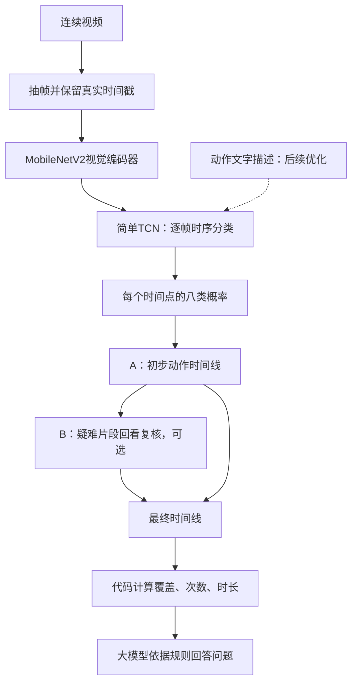

# 六步洗手模型实施方案

版本：2026-10-01。适用周期：15—30天。目标：先保证识别效果，再增加语言辅助与问答。

**本文是待实施的组内技术方案，不是已完成的功能说明。** 第一版采用“MobileNetV2视觉编码器＋简单TCN”，输出动作时间线，再由代码统计并供大模型问答。PE和MS-TCN++保留为升级候选；语言辅助与B局部复核分别通过实验决定是否加入。本次只更新文档，现有代码与默认配置没有随之切换，参数表不能直接当作已接入的CLI配置。

### 本次调整与提案的关系

保留“动作时间线 → 流程统计 → 问答，可选B复核”的系统结构。修改的是基础识别模型及实验顺序：先复用已有MobileNetV2与TCN实现建立可靠基线，再分别比较视觉表示和时序头，不预先认定PE＋MS-TCN++最优。YOLO和GRU仍是必要对照，不再把原提案路线称为已淘汰的历史方案。

原提案也包含逐帧预测、动作分段和规则报告，逐帧分类与区间输出并不冲突。保留逐帧Macro-F1及原提案O1的0.80目标，同时增加动作段、时长和漏步评价；0.80不是已实现的结果或性能保证。最终报告应如实说明实际模型与已提交提案的差异，不改写已提交的提案副本。

本文沿用仓库允许的内部中文工作文档定位，尚未登记为正式双语主文档。正式对外发布时再补英文镜像并登记配对。

## 1. 做出来是什么样

输入一段完整洗手视频，输出每个动作的开始时间、结束时间和类别。例如：

| 开始 | 结束 | 动作 |
| --- | --- | --- |
| 0秒 | 3秒 | 其他动作 |
| 3秒 | 8秒 | 掌心相对 |
| 8秒 | 13秒 | 搓手背 |
| 13秒 | 18秒 | 十指交叉 |
| 18秒 | 23秒 | 搓拇指 |
| 23秒 | 28秒 | 搓指尖 |

这些时间只是输出示例，不是实测结果。区间长短由模型识别出的动作变化决定，不按固定5秒切段。允许缺步、乱序和重复，不强迫输出完整的1→6。

系统根据时间线计算六步覆盖、各步累计时长和重复次数。对上例可报告“未检出第4步”；画面存在遮挡时，应提示“无法确认”，不能把看不清直接当成没做。第一版分析已录制的完整视频，可以使用前后文；实时摄像头版另行设计。

## 2. 模型分成三层



| 层 | 负责什么 | 第一版是否需要训练 |
| --- | --- | --- |
| A基础识别 | 看视频、识别动作、确定时间区间 | 先训练帧分类器，再冻结骨干训练TCN |
| B局部复核 | 回看A难以区分的片段，尝试纠错 | 先测现成视频大模型，有收益再考虑微调 |
| 问答层 | 解释漏步、时长、重复，引用对应区间 | 先用提示词和统计函数，不训练 |

先交付MobileNetV2＋TCN的A＋问答。B必须在验证集证明“纠正的错误多于引入的错误”后再接入。

## 3. 先把数据准备对

### 3.1 用什么数据和标签

PSKUS作为主训练数据：3,185段医院视频，30 FPS，原始动作标签为0—7。METC作为跨场景测试：212段视频，约16 FPS，公开动作标签为0—6。完整来源见[PSKUS](https://zenodo.org/records/4537209)和[METC](https://zenodo.org/records/5808789)。

| 原始code | 训练类别 | 中文名称 |
| --- | --- | --- |
| 0 | other | 其他动作 |
| 1 | step_1 | 掌心相对 |
| 2 | step_2 | 搓手背 |
| 3 | step_3 | 十指交叉 |
| 4 | step_4 | 指背互扣 |
| 5 | step_5 | 搓拇指 |
| 6 | step_6 | 搓指尖 |
| 7 | faucet_off | 用纸巾关闭水龙头 |

表中的step_1等是阅读简称，代码中使用`core/labels.py`的规范枚举。新建独立的PSKUS八类标签空间，不直接覆盖旧十类空间。原始code、训练通道下标和中文名称的映射必须随checkpoint保存。

`other`既可能发生在洗手期间，也可能出现在其他时刻；它不等于“错误动作”。PSKUS没有独立的开水龙头类别。METC把错误执行合并进other，因此不能拿它直接训练六种具体动作的质量判断。

### 3.2 准备顺序

1. 按原始视频划分train/val/test，起点比例70%/15%/15%，固定seed=42。人物身份可确认时优先按人物分组；至少检查机位、日期和重复视频，记录剩余泄漏风险。
2. 初筛子集覆盖多个分片、机位和六类动作，不能只取单个DataSet。相同划分用于所有对照实验。
3. 从原视频按时间采样，第一轮5 FPS；保留原始帧号和时间戳。30 FPS视频的第90帧约为3秒，不能用90÷5计算时间。
4. PSKUS的`frame_time`以毫秒计，除以1000转成秒；按时间戳对齐抽出的画面与标注。METC使用其原始JSON标签与视频时序，单独适配，不假定30 FPS。
5. 保存每个采样点的`video_id、split、原始帧号、timestamp_s、图像路径、动作标签、标注者`。没有可靠标注的帧保留掩码，不擅自填为other。
6. 人工逐帧抽查至少10段，覆盖六步、切换边界和不同机位；确认“画面—标签—时间”一致后再抽全量。

METC作为最终测试时，不用它选模型、改描述或调阈值。若另做少样本适配，必须单独划出适配集，并与零适配结果分开报告。自采视频也要区分开发集与最终测试集。

## 4. A模型怎么搭

### 4.1 看一帧：MobileNetV2视觉编码器

第一版复用`models/frame_cnn.py`中的MobileNetV2，使用ImageNet预训练权重、224×224输入和配套ImageNet归一化。先训练逐帧分类器，检查六步的区分能力，再用它的骨干提取视觉特征。这里选择MobileNetV2是为了尽快跑通与定位问题，不代表它已经胜过YOLO或PE。

先输入全画面，再单独比较完整保留双手的稳定裁剪；裁剪失败时回退全画面。不同编码器必须使用各自配套预处理，不能为了统一尺寸而用错归一化。

```text
图像批次：        [B, T, 3, 224, 224]
逐帧视觉特征：    [B, T, D]
```

`B`是视频窗口数，`T`是窗口帧数，`D`从骨干实际输出读取。第一版直接复用`TemporalClassifier`调用骨干，不要求先新建特征缓存流水线。后续冻结骨干实验可缓存特征，记录checkpoint、预处理、划分、帧号和时间戳；设置改变后重新提取。

### 4.2 看连续变化：简单TCN

复用`models/temporal.py`中的`TCNHead`：特征投影后经过膨胀因果卷积残差块，每个时间点输出自己的类别。第一版仅交付完整视频离线分析；TCN头使用因果卷积并不代表整个抽帧、窗口、合并和问答系统已经支持实时运行。

```text
时序头输入：      [B, T, D]
卷积内部表示：    [B, H, T]
分类输出：        [B, T, 8]
每个时间点标签：  [B, T]
```

`H`为时序隐藏通道数。这里的八类是目标标签空间，需要先完成标签映射迁移；当前配置仍有旧类别空间，不能仅修改输出维度就开始训练。

窗口可能跨越动作切换，每帧都要有自己的标签，不能用窗口多数标签监督整段。短窗口补齐后使用mask，padding不参与损失或指标。不同窗口独立组织，按原视频位置合并，不能仅按video_id直接拼接重叠窗口。

### 4.3 第一轮训练与升级顺序

| 项目 | 起始设置 | 说明 |
| --- | --- | --- |
| 采样率 | 5 FPS | 与现有2 FPS配置区分；必要时比较2/5/10 FPS |
| 视觉骨干 | ImageNet预训练MobileNetV2 | 先训练逐帧分类器，再冻结骨干训练TCN |
| 输入尺寸 | 224×224 | 使用ImageNet归一化 |
| 训练窗口 | 128帧，约25.6秒 | 连续取帧；短视频padding并加mask |
| 时序头 | 简单TCN，隐藏通道128 | 复用仓库实现，其余结构参数先沿用配置 |
| batch size | 先以2个图像窗口试跑 | 图像窗口不同于特征窗口，按实测显存调整 |
| 优化器 | AdamW | 帧模型学习率从5e-4起；冻结骨干后的TCN从1e-3起 |
| 训练轮数 | 各阶段最多30轮 | 验证Macro-F1连续5轮未改善则停止 |
| 损失 | 掩码加权交叉熵 | 第一版不依赖多阶段或文本损失 |

表中是待实现的实验起点，不是现有命令的默认行为。类别权重只用训练集统计，可从逆平方根频率开始并限制极端权重；涉及裁剪、翻转等增强时，同一窗口使用相同几何变换。先检查小训练集能否拟合，再训练完整数据。不得因缺少真实数据而静默回退到合成样本。

升级按以下顺序进行，每次只改变一个主要因素：

1. **视觉表示**：比较MobileNetV2、提案中的YOLO分类骨干、冻结PE-Core-L14-336。使用相同划分和同一种逐帧头或TCN；分别记录预处理、冻结/微调策略与成本，避免把不同训练预算的差异全归因于架构。
2. **时序模型**：固定胜出的视觉表示，比较无时序、简单概率平滑、GRU、简单TCN；再测试MS-TCN++是否进一步改善动作段预测。
3. **语言与复核**：先独立测试文本辅助，再测试B。没有稳定收益的模块不进入默认流程。

PE先冻结、分批提取特征后缓存，使用其checkpoint配套预处理；不要套用MobileNetV2或YOLO设置。MS-TCN++如进入实验，使用公开实现并记录版本与许可，保留逐帧监督、padding掩码和各阶段损失；不能把简单TCN称为MS-TCN++。

`MeanPoolHead`当前实际上是逐帧线性分类头，没有执行时间平均。实验中将它记作“无时序线性头”；真正的概率平滑需另做，避免混淆对照。

### 4.4 把预测合并成时间区间

推理覆盖整段视频，窗口长度128、步长64作为起点。重叠部分先平均分类概率，再取类别；不能先取类别后随意投票。尾部补齐并用mask去掉，保证视频最后一个动作也被预测。

```text
各窗口概率 → 按原始时间位置合并 → 每个时刻取最高概率类别
          → 相邻同类合成区间 → 写入开始时间、结束时间和置信度
```

区间统一用`[start_s, end_s)`表示：从第一帧时间戳开始，到下一段的第一帧时间戳结束；最后一段结束于真实视频末尾。时长按时间差计算。5 FPS提供约0.2秒的采样间隔，不代表实际边界误差必然小于0.2秒。

先保留原始时间线。可另试约0.6秒的概率平滑，但不得无条件删除所有短段，否则真实的“某步太短”也会消失。低置信度用`uncertain`状态表示，不替换成other，不强制恢复标准顺序。

### 4.5 A跑通后，再加语言辅助

文本辅助是可选研究项，不是MobileNetV2＋TCN运行的前提。如果PE验证有效，可使用它的配套文本编码器；若视觉骨干仍为MobileNetV2，需显式训练到文本空间的投影，不能直接比较未对齐的向量。为六步和关水龙头各写2—3条经人工核对的短描述。例如“掌心相对摩擦”和“掌心相对，手指交叉摩擦”，突出容易混淆的视觉差异。选择并固定文本编码器，检查token长度，避免描述被截断。

将文本向量归一化后按类别平均，得到动作文本原型；再将时序隐藏特征投影到相同维度。增加视频特征与正确文本原型之间的对比分类损失，辅助权重先取0.1。保留原八类分类头作为输出；other不参加这项文本对齐损失。没有标签或标注分歧较大的帧不用于强文本对齐。

比较“同一模型不加文本”和“加文本”，其余设置相同。收益不足就保留纯视觉版本。由类别映射得到的句子属于标准动作描述，不能声称模型额外观察到了指尖接触、左右手覆盖等未标注细节。

## 5. B如何作为A的优化

先试`Qwen3-VL-4B-Instruct`对疑难片段做选择题。第一版B仅复核类别，沿用A的区间边界。每次提供对应片段和前后约1秒上下文，同时明确待判断的是中间区间；片段较长或含明显切换时拆开复核。

候选选择A最可能的两个动作，另加“其他类别”和“无法判断”。例如询问“中心区间更符合掌心相对，还是掌心相对且手指交叉？”。B必须看到实际视频，不能只看标签和标准六步顺序。

触发条件可用最高概率偏低、前两类概率接近或短时间频繁跳变。先在验证集调节阈值和调用比例，不能根据测试集答案挑片段。模型自报的置信度不直接当作可靠概率。

融合规则先保持简单：未触发时保留A；B返回“其他类别／无法判断”时保留A的候选并标记待确认；B选择另一动作时，仅在验证过的纠错策略下替换。记录A原结果、B输出和最终决定，以便统计纠正数与改错数。

B的验收同时看最终动作段F1、漏步检测、纠错净收益和额外耗时。也抽查A高置信度样本，防止只研究低置信度而遗漏系统性误判。B没有稳定收益时，不进入最终默认流程。

## 6. 问答读取什么

每个区间保存如下记录。以下是建议的新输出格式，尚未修改现有`core/schema.py`。

```json
{
  "video_id": "demo_01",
  "start_s": 3.0,
  "end_s": 8.0,
  "label": "step_1_palm_to_palm",
  "description": "掌心相对搓洗",
  "mean_probability": 0.86,
  "status": "recognized",
  "reviewed_by_b": false
}
```

代码先计算各步覆盖、累计时长、重复次数和不确定区间。问答模型接收这些记录、明确的评估规则和用户问题，回答时引用区间。例如“3—8秒检出掌心相对搓洗，持续5秒”。`mean_probability`是分类概率的均值，不等同于校准后的正确率。

单步时长阈值、允许重复和顺序要求属于项目评估口径，需明确配置，不能让大模型临时编造，也不能冒称为WHO硬性标准。不确定区间占据关键部分时，回答“无法确认”。现有标签不能证明洗手达到清洁效果，也不足以判断每个动作的精细执行质量。

## 7. 在仓库里按什么顺序实现

以下状态核对至仓库提交`8fcfbc9`；这些待办尚未由本次文档更新实现。

| 顺序 | 工作与位置 | 完成标志 |
| --- | --- | --- |
| 1 | 复验已修复的逐帧标签与源码跟踪 | 新提交已接入逐帧标签及标注时间、补入模型源码；抽查真实数据并重建受旧错误影响的manifest |
| 2 | 修复`io/video.py`两个解码后端的时间轴 | index是原始帧号；恒定帧率按index/native_fps，变帧率按可靠解码时间戳，不能除采样FPS |
| 3 | 去除完整视频评估中的前缀截断 | `_extract_and_register`传入max_frames会使解码提前结束；评估必须覆盖首尾，不能把未读取的后半段算作漏步 |
| 4 | 完成PSKUS八类标签空间及METC适配 | 保留旧权重映射，明确共同七类评估；METC不参与选模 |
| 5 | 复用MobileNetV2、TCN和模型接口，检查窗口与mask | 前向输出`[B,T,8]`，padding不计损失，单段可拟合 |
| 6 | 接入完整时间线与统计、问答 | 概率覆盖视频首尾，区间单调不重叠，统计与真实时间一致 |
| 7 | 分别比较PE、GRU、MS-TCN++、语言与B | 每项有独立开关及同划分对照，不用问答掩盖识别错误 |

时间戳核查示例：30 FPS视频按5 FPS抽取原始帧0、6、12，其时间应为0、0.2、0.4秒；当前OpenCV函数却给出0、1.2、2.4秒。原始第90帧应为3秒，当前返回18秒。PSKUS新manifest用标注时间绕开了此错误，不等于底层解码已修好；imageio路径同样错误地用原始帧号除有效采样率，需要一并修复。

先复用`models/frame_cnn.py`与`models/temporal.py`，检查`data/dataset.py`及训练、推理的连续窗口处理。只有进入升级实验时才新增PE特征缓存、MS-TCN++适配或`pipelines/review.py`，不将它们作为基础版本前置工作。

**本次只修改方案和入口文档。** 标签空间、配置字段、数据结构和判定规则的后续修改按[仓库修改规则](CONTRIBUTING.md)提交RFC并迁移旧实验。旧命令不会因文档修改自动运行新方案。

## 8. 做哪些实验，何时交付

| 实验 | 模型 | 回答的问题 |
| --- | --- | --- |
| M1 | MobileNetV2逐帧分类 | 单帧基线及标签链路是否可靠 |
| M2 | M1＋概率平滑 / 简单TCN | 学习时间上下文是否优于简单平滑；TCN为初始交付模型 |
| M3 | YOLO、PE与MobileNetV2使用同一种头 | 哪种视觉表示更适合这些视频 |
| M4 | 固定视觉表示，比较GRU、TCN、MS-TCN++ | 时序结构及多阶段细化是否有额外收益 |
| M5 | 胜出的A＋文本对齐 | 语言是否帮助区分相似动作 |
| M6 | 胜出的A＋B复核 | 复核净收益与额外耗时 |

M1—M6是本方案的计划编号，不覆盖实验日志原有E编号；实际运行另记run_name和config_hash。先完成M1/M2，再分阶段执行升级实验，不穷举所有组合。验证集逐帧Macro-F1是主要选模依据，同时检查逐类召回、分段、时长和漏步是否退化；候选提升需复跑确认并记录成本。测试集只用于最终报告，不用于挑模型或阈值。

都报告八类Macro-F1、六步逐类召回率、segmental F1@10/25/50和各步累计时长MAE。动作段F1按相同类别、时间IoU阈值和一对一匹配计算；同时报告包含全部类别与仅六步的口径。流程层报告漏步检测precision/recall，避免用大量正常视频掩盖漏检。

METC评估时，将PSKUS第7类的概率加到other，转换为共同七类空间后再预测。仍要说明两个数据集的other语义不同，且METC有实时人工标注延迟。最终测试保留真实短动作和完整时间线，不为提高指标裁掉困难边界。

| 时间 | 交付物 |
| --- | --- |
| 第1—3天 | 复验标签修复，修正时间轴与评估截断，固定划分和抽查 |
| 第4—7天 | M1/M2：MobileNetV2＋TCN基线、失败案例分析，跑通完整时间线 |
| 第8—11天 | M3/M4：先比较视觉表示，再比较时序头；时间不足保留已验证基线 |
| 第12—15天 | A＋问答演示、最终测试、实验记录；两周版本在此交付 |
| 第16—25天 | M5/M6：语言和B分别做消融，有收益才纳入 |
| 第26—30天 | 固定设置，完成最终评估、消融和报告 |

验收至少包含完整、漏步、换序、短动作、重复补做和遮挡视频，并保存人工区间答案。所有阈值在开发／验证数据上确定；最终测试只在方案固定后执行。若A的动作类别仍分不清，优先检查数据、手部可见性和视觉特征，不用问答层掩盖识别错误。

## 9. 实现时优先看的资料

- [PE官方代码与模型](https://github.com/facebookresearch/perception_models)：视觉和文本编码器。
- [MS-TCN++官方代码](https://github.com/sj-li/MS-TCN2)：连续动作分段；集成时遵守原仓库许可并记录版本。
- [MMF-TAS，ICCV 2025](https://openaccess.thecvf.com/content/ICCV2025/html/Lu_Multi-Modal_Few-Shot_Temporal_Action_Segmentation_ICCV_2025_paper.html)：借鉴视觉／语言动作原型思想，本文不声称复现其少样本任务。
- [LLaVAction，ICLR 2026](https://arxiv.org/html/2503.18712v2)：借鉴相似动作的困难选项训练和结构化辨别。
- [Qwen3-VL官方代码](https://github.com/QwenLM/Qwen3-VL)：B局部视频复核的候选实现。
- [TemporalVLM，ACL Findings 2026](https://aclanthology.org/2026.findings-acl.70/)：带时间信息的视频理解参考。

这些论文和模型提供方法依据，不代表已经在本项目取得同样效果。新方案的性能由上述对照实验决定。
